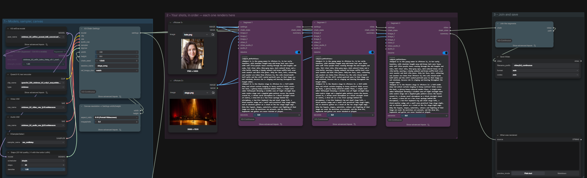
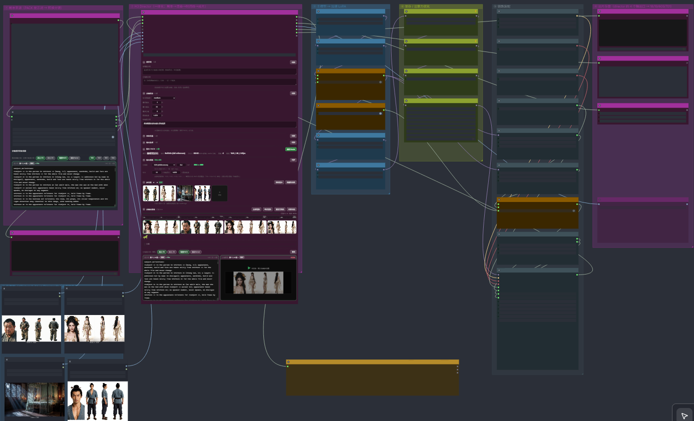
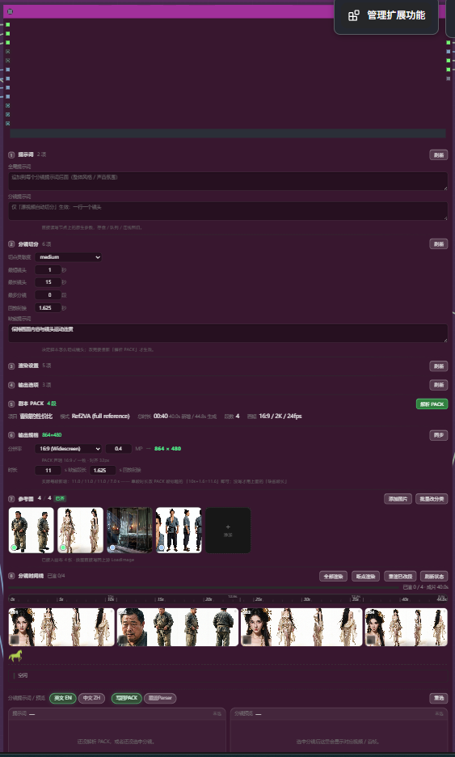
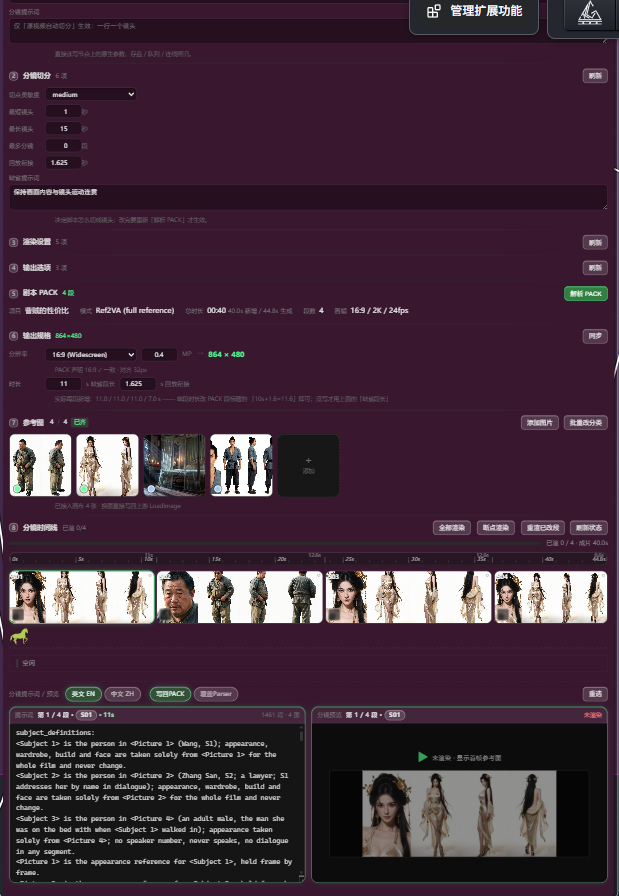

# ComfyUI_Marquee_Director

Pack name: `ComfyUI_Marquee_Director`

> 派生自 [`loopforge0/ComfyUI-H3-Continuous`](https://github.com/loopforge0/ComfyUI-H3-Continuous)
> （MIT，© 2026 Greg Henry），本仓库在其基础上改名并继续维护。
> 节点 ID 与输出目录**刻意保持原样**，以兼容既有工作流与已渲染素材。
> 出处与许可详见文末 [Credits](#credits)。

Chain any number of MiniMax H3 renders into **one unbroken take**.

Each segment opens on an exact replay of the last ~1.6 seconds of the segment before
it, so the joins are invisible — not "similar framing", the same frames. Write a prompt
per shot, wire the references, hit Run once.



---

## It runs on 8 GB

**Reference machine: RTX 3070, 8192 MB VRAM, 40 GB system RAM.** Every number below was
measured on it, at **864×480 (0.4 MP, 16:9)**, turbo LoRA, 8 steps.

The model is 20 GB and the text encoder is another 25 GB. Neither fits in 8 GB, and
neither is supposed to — ComfyUI streams both, staging them in system RAM and pulling
weights in per step. The card is not the wall; the activation peak is.

| | measured on the 8 GB RTX 3070 |
| --- | --- |
| One 11.5 s shot — 277 frames, 8 steps | **5 min 34 s – 5 min 37 s** |
| A 4-shot chain → 41 s finished take | **25 min 38 s** |
| Sampling, per step, at this size | **37 – 48 s/it** |

For reference, the same pack's own benchmark table further down was taken on a 12 GB
RTX 3060. 8 GB costs you time, not capability — a four-shot continuous take still lands
under half an hour.

### The two nodes that make it fit

On 8 GB, put these between the LoRA loader and the model input. This is exactly what the
shipped director workflow already does:

```
LoraLoaderModelOnly ──► MiniMaxChunkFeedForward ──► MiniMaxLowVRAMAttention ──► ModelAttentionBackend
                          chunks = 4                   head_chunks = 4
```

| Node | Ships in | Setting | What it buys |
| --- | --- | --- | --- |
| `MiniMaxChunkFeedForward` | [ComfyUI-KJNodes](https://github.com/kijai/ComfyUI-KJNodes) | `chunks` **4**, `seq_threshold` **2048** | Chunks the H3 feedforward (SwiGLU) over the packed token dim. More chunks = lower peak VRAM, slightly more overhead. |
| `MiniMaxLowVRAMAttention` | [ComfyUI-KJNodes](https://github.com/kijai/ComfyUI-KJNodes) | `head_chunks` **4** | Splits the attention call into head groups, so the kernel's internal transients — the int8 q/k copies and the fp32 accumulator — shrink by the chunk count, and frees the fused qkv buffer as soon as it is consumed. |

Both are `KJNodes/experimental`, and both are **lossless**: their author documents each
as *"Output is identical to the unpatched model."* You are trading speed for headroom,
not quality. The director workflow wires them through a `LazySwitch` driven by a
`BOOLConstant`, so the low-VRAM path can be switched out in one click once you move to a
bigger card.

### If you do run out

* Drop the megapixel budget on **ResolutionSelector**. `0.3` MP (736×416 in 16:9) is the
  next step down and roughly a third less to compute.
* Raise `chunks` / `head_chunks` to 6 or 8. Overhead rises, output does not change.
* Turn on `unload_models_after` on **only** the segment where it OOMs — see
  [the knobs that matter](#the-knobs-that-matter).

---

## Setup

Two steps, about 42 GB of downloads, and a `git clone`. There is nothing to
`pip install` — this pack has no dependencies of its own.

You need **ComfyUI 0.34.0 or newer**. *Settings → About* shows your version. Older
builds have no MiniMax H3 nodes at all, so nothing here will load.

### 1. Get the nodes

```bash
cd ComfyUI/custom_nodes
git clone https://github.com/kkqiu007/ComfyUI_Marquee_Director.git
```

That is the whole install — this pack has no dependencies of its own and is not
on the ComfyUI registry.

Keep the folder name exactly as it comes out of the clone. ComfyUI derives the
package name from the directory name, so renaming it breaks the pack.

Already have it installed and just want to update? `git pull` in that folder.
There is no build step; a restart picks the change up.

Restart ComfyUI. To check it worked, double-click the empty canvas and type
`H3 Chain` — if **H3 Chain Settings** comes up, the nodes are installed.

Model download list, mirror URLs and the output layout live in
[INSTALL_STATUS.md](INSTALL_STATUS.md).

### 2. Get the models

Five files, all from [Comfy-Org/MiniMax-H3](https://huggingface.co/Comfy-Org/MiniMax-H3):

| Download | Put it in |
| --- | --- |
| [`minimax_h3_ref2va_pruned_int8_convrot.safetensors`](https://huggingface.co/Comfy-Org/MiniMax-H3/blob/main/diffusion_models/minimax_h3_ref2va_pruned_int8_convrot.safetensors) (20 GB) | `ComfyUI/models/diffusion_models/` |
| [`qwen3vl_32b_minimax_h3_nvfp4_awq.safetensors`](https://huggingface.co/Comfy-Org/MiniMax-H3/blob/main/text_encoders/qwen3vl_32b_minimax_h3_nvfp4_awq.safetensors) (15 GB) | `ComfyUI/models/text_encoders/` |
| [`minimax_h3_video_vae_fp16.safetensors`](https://huggingface.co/Comfy-Org/MiniMax-H3/blob/main/vae/minimax_h3_video_vae_fp16.safetensors) | `ComfyUI/models/vae/` |
| [`minimax_h3_audio_vae_fp32.safetensors`](https://huggingface.co/Comfy-Org/MiniMax-H3/blob/main/vae/minimax_h3_audio_vae_fp32.safetensors) | `ComfyUI/models/vae/` |
| [`minimax_h3_ref2v_turbo_4step_v0.1_comfyui_bf16.safetensors`](https://huggingface.co/Comfy-Org/MiniMax-H3/blob/main/loras/minimax_h3_ref2v_turbo_4step_v0.1_comfyui_bf16.safetensors) | `ComfyUI/models/loras/` |

It must be the **ref2va** model, not `fl2va`. This pack chains *reference*-conditioned
renders; the fl2va model does not take reference images and the workflow will not run
on it.

The last one is the turbo LoRA. It is optional but you almost certainly want it: it
cuts sampling from 20 steps to 4. On a 12 GB card that is the difference between
**5 minutes a shot and 31 minutes a shot**.

On 8 GB it is not a trade-off at all — it is the difference between a take you can
iterate on and one you cannot. Measured figures on the 8 GB reference card are in
[It runs on 8 GB](#it-runs-on-8-gb).

Once the files are in place, hit **R** on the ComfyUI canvas (or restart it) so the
loader dropdowns pick them up.

The workflow carries this same list in a blue **Models** note on its canvas, and each
loader node carries its download URL in `properties.models` the way ComfyUI's own
templates do — so a missing file is something ComfyUI can offer to fetch on open,
rather than an unexplained empty dropdown.

### 3. Open a workflow

Two examples ship in `workflows/`. They are the same chaining engine wired two
different ways — start with the first, move to the second when your shot count
grows past three or four.

---

#### A — `workflows/h3_continuous.json` · runs as-is

Drag it onto the canvas. A finished worked example: a singer alone in a
spotlight, one continuous ~21-second take in three shots.

| On the canvas | What it is |
| --- | --- |
| **A — the chain** (purple) | A finished worked example that runs as-is. |
| **B — repair** (bypassed) | Re-render one bad shot without disturbing the rest. Ships switched off, below the chain, sharing the same models and settings. |
| **Models** / **Start here** / **Repair** notes | Download links, the storage tree, and how to drive each half. |

**It runs as it opens.** Copy the two files in `example_inputs/` into `ComfyUI/input/`
and hit Run — nothing else needs setting. About 27 minutes on a 12 GB card with the
turbo LoRA on, and the same engine has been measured on the 8 GB reference card at
**5 min 34 s for one 11.5 s shot** and **25 min 38 s for a four-shot, 41-second take**
(see [It runs on 8 GB](#it-runs-on-8-gb)). Read its three prompts side by side
afterwards; that is where the method is.

To make it yours, edit in place: rewrite the prompts, swap the `Load Image` nodes, and
add or delete **H3 Render Segment** nodes to change the shot count. There is no separate
blank template — a worked example you edit beats an empty one you have to fill.

**Needs:** this pack, plus ComfyUI's own nodes. Nothing else.

---

#### B — `workflows/h3_director_unlimited_storyboard.json` · panel-driven, needs setup

Same chain, but you do not hand-wire one **H3 Render Segment** per shot. You write
the script, the **H3 Director** panel parses it into a storyboard, and the chain
renders from that. This is the one to copy once you are doing real multi-shot work.



> **⚠️ It does not run out of the box.** It is published as a reference for how the
> panel is wired, and it loads checkpoints and reference images that are not in this
> repo. Before it will render you have to swap two things:

**1. The checkpoints.** It points at files that are not published here:

| Loader | Points at | Use instead |
| --- | --- | --- |
| `UNETLoader` | `Minimax_H3/Minimax-h3_Singularity_ref2va_Pruned_v1.3_int8.safetensors` | `minimax_h3_ref2va_pruned_int8_convrot.safetensors` |
| `CLIPLoader` | `qwen3vl_32b_minimax_h3_int8_convrot.safetensors` | `qwen3vl_32b_minimax_h3_nvfp4_awq.safetensors` |
| `VAELoader` (video) | `minimax_h3_video_vae_int8_convrot.safetensors` | `minimax_h3_video_vae_fp16.safetensors` |
| `LoraLoaderModelOnly` ×2 | `H3/H3_Combat_V2.safetensors`, `H3/minimax-h3-facial-realism-closeup-cp2000_comfy_prefix.safetensors` | anything you like — they ship at strength `0`, so bypassing them changes nothing |

The four files in the right column are the ones listed under **Get the models**
above, so if you set up workflow A you already have them.

**2. The reference images.** The four `Load Image` nodes point at PNGs generated on
the author's machine (`Qwen_4View_sheet_*`, `Krea2_turbo_*`, `krea2_identity_edit_*`).
Drop in your own.

The wiring, the Director settings and the storyboard JSON format are the part worth
copying. The assets are not.

**Needs:** this pack, ComfyUI's own nodes, and three community packs —

| Pack | Used for |
| --- | --- |
| [ComfyUI-KJNodes](https://github.com/kijai/ComfyUI-KJNodes) | `BOOLConstant`, `MiniMaxChunkFeedForward`, `MiniMaxLowVRAMAttention` |
| [comfyui-obvpm](https://github.com/obvpm/comfyui-obvpm) | `LazySwitch` |
| [comfyui-custom-scripts](https://github.com/pythongosssss/ComfyUI-Custom-Scripts) | `ShowText` |

---

## Your first run

Open the workflow and work left to right through group **A**.

**1 — Models (the blue group).** Point the five loaders at the files you just
downloaded. Most of them will already be right if you only have one of each.

Then decide your quality/speed trade-off:

* **Fast (recommended to start):** click the **Turbo LoRA** node once and press
  **Ctrl+B** to un-bypass it, then set **BasicScheduler** `steps` to **4**.
* **Best quality:** leave the LoRA bypassed (it ships that way) and `steps` at 20.

Set the canvas size on **ResolutionSelector** — pick an aspect ratio and a megapixel
budget. `0.41` MP (480×864 in 9:16) is a good, safe starting point on 12 GB. On 8 GB,
**`0.4` MP / 16:9 → 864×480** is the setting every figure in
[It runs on 8 GB](#it-runs-on-8-gb) was measured at.

**2 — Shots (the purple group).** One **H3 Render Segment** node per shot, wired in a
line: each node's `chain_state` output goes into the next node's `chain_state` input.
The first node's `chain_state` input stays empty.

On each node:

* **`prompt`** — the example's real prompts are in here. Rewrite them, but keep the
  section headings (`subject_definitions:`, `summary:`, and so on); H3 expects them.
* **`seconds`** — how long this shot runs.
* **reference images** — every shot is wired to the same two `Load Image` nodes,
  `kate.png` on `image_0` and `stage.png` on `image_1`. Click a filename to pick your
  own (anything in `ComfyUI/input/`, or the node's **choose file to upload** button).
  `image_0` becomes `<Picture 1>` in your prompt, `image_1` is `<Picture 2>`, and so on.
  **Feed the same image into every shot** — that is what keeps a character looking like
  the same person.

Two rules that will bite you if you skip them:

* **Repeat your camera, lighting and character descriptions word for word in every
  shot.** Not paraphrased. That verbatim repetition is what holds the look together
  across the joins.
* **Nothing new can happen in the first ~1.6 seconds of any shot after the first.**
  Those frames are a fixed replay of the previous shot. Schedule your first new action
  after the 1.7-second mark.

**3 — Name the session.** Set `session_name` on **H3 Chain Settings** to anything you
like. Everything lands in `ComfyUI/output/h3_continuous/<session_name>/`.

**4 — Hit Run.** Once. That is the whole thing.

Shots render one at a time and each is written to disk the moment it finishes, so you
can watch the take build up in the session folder. When the last one is done,
**H3 Chain to Video** stitches them into `<session_name>.mp4`.

If you stop it, change your mind, or crash: **just hit Run again.** Only the shots
whose settings actually changed get re-rendered. See
[It resumes](#it-resumes-and-that-changes-how-you-work).

### How long it takes

**8 GB — the author's own machine.** RTX 3070, 8192 MB, 40 GB RAM, 864×480, turbo LoRA
at 8 steps:

| | measured |
| --- | --- |
| One 11.5 s shot (277 frames) | **5 min 34 s – 5 min 37 s** |
| A 4-shot chain → 41 s take | **25 min 38 s** |
| Per sampling step | **37 – 48 s/it** |

**12 GB — the pack's original benchmark.** RTX 3060 at 480×864, per shot:

| | 4-second shot | 8-second shot |
| --- | --- | --- |
| turbo LoRA, 4 steps | ~5 min | ~9 min |
| no LoRA, 20 steps | ~18 min | ~31 min |

The model is 20 GB and the text encoder is 25 GB. **Neither fits in 12 GB, and neither
fits in 8 GB** — it streams weights every step, on both. That is why a 12 GB card and an
8 GB card land within a factor of two of each other rather than 10×: the bottleneck is
how fast weights can be pulled, not how much room you have to hold them. More VRAM is
still a large speed-up, because it cuts the streaming.

On 8 GB specifically, wire in `MiniMaxChunkFeedForward` and `MiniMaxLowVRAMAttention` —
see [The two nodes that make it fit](#the-two-nodes-that-make-it-fit). They cap the
activation peak, which is the part 8 GB actually runs out of.

If you hit out-of-memory partway through a long chain, turn on `unload_models_after` on
the single shot where it happens.

---

## The knobs that matter

| Setting | Where | What it does |
| --- | --- | --- |
| `seconds` | Render Segment | Length of this shot. Snapped up to H3's 17k+5 grid (8 s → 192 frames). Trained range ≈ 5–15 s. |
| `handoff_seconds` | Render Segment, advanced | How much of **this** shot's ending the **next** one opens on. Snapped down to 5 / 22 / 39 / 56 frames. Set to 0 on the last shot of a take. |
| `seed_override` | Render Segment, advanced | 0 derives from the chain seed. Set it to re-roll one shot. |
| `model` | Render Segment | Optional. A MODEL for this shot only, overriding the Settings one — this is where a per-shot LoRA goes. |
| `chain_seed` | Settings | Changing it re-renders everything. |
| `resume` | Render Segment | Reuse this segment if unchanged (see below). |
| `handoff_mode` | Settings, advanced | `latent` (default) slices the handoff out of the sampled latent — no VAE, exact anchor, faster. `pixel` is the old decode/re-encode route; use it only to change resolution mid-session. |
| `stabilize` | Chain to Video, advanced | 1.0 flattens the take's slow colour drift away from its own opening. Costs no GPU. **Leave it on.** |
| `drift_arrest` | Settings, advanced | Experimental, ships at 0. Steers the latent but overshoots the picture; no measured benefit. [Why](docs/how-it-works.md#drift_arrest). |
| `unload_models_after` | Render Segment, advanced | Unload models after this segment. OOM-only — turn it on for just the segment where you actually OOM. |

**Set `handoff_seconds` to about a fifth of `seconds`.** That is the one rule. The
1.625 s default is right for 8-second shots and wrong for short ones — on a 4-second
shot it is 36 % of the whole thing, past the point where the model has too little free
footage left and the seam starts to show.

| shot length | use |
| --- | --- |
| 8 s | **1.625 s** (the default) |
| 5-6 s | 0.917 s |
| 4 s | **0.917 s** |
| under 4 s | 0.917 s, and consider longer shots instead |

Longer handoffs also cost you finished footage: at 8 s shots with a 1.625 s handoff,
every shot after the first contributes 6.375 s to the cut. The reasons behind the exact
numbers — why 39 frames in particular, and what the audio grid has to do with it — are
in [how it works](docs/how-it-works.md#1-anchor-the-tail-dont-reference-it).

### A LoRA on one shot

**H3 Render Segment** has an optional `model` input. Wire one in and that segment
renders on it instead of the model on **H3 Chain Settings**; leave it unconnected and
nothing changes. There is no LoRA widget on the node, because ComfyUI already has good
LoRA nodes and this way you get all of them:

```
Load Diffusion Model ─┬─ LoraLoaderModelOnly (turbo) ─┬─ H3 Chain Settings . model
                      │                               ├─ H3 Render Segment 2 . model
                      │                               └─ LoraLoaderModelOnly (dance) ─ H3 Render Segment 3 . model
```

Two things to hold on to:

**Chain the turbo LoRA through, don't replace it.** The input swaps the model out
rather than adding to it, so a segment handed a bare checkpoint samples on 4-step
sigmas without the LoRA those sigmas exist for — 4 steps of a 20-step model, which
looks like a render that gave up half way.

**MODEL only.** H3 LoRAs are diffusion-side; there is no CLIP input here, and routing
one through Qwen3-VL is not what they are trained for.

Changing a LoRA or its strength re-renders that segment and every segment after it even
with `resume` on — the cache key reads the model's patch list, so it sees the swap. That
is also the cost: a style LoRA dropped onto shot 2 of a six-shot take re-renders five
shots. Settle the take first, then decorate.

---

## It resumes, and that changes how you work

Every finished segment is written to `output/h3_continuous/<session>/`:

```
seg_01.mp4          the segment
seg_01.tail.mp4     the clip segment 2 opens on
seg_01.tail.wav     that clip's soundtrack, sample-exact
manifest.json       what was rendered, and the fingerprint of each segment
stage_song.mp4      the joined cut
```

**Each shot is its own node execution**, not one loop hidden inside a container node, so
`seg_03.mp4` and `manifest.json` are both written to disk the moment segment 3 finishes —
not when the whole chain finally does. Wire a Preview Video node (or anything else) to
any segment's `video` output and it plays as soon as that one segment is done, while
later segments are still rendering. The manifest is rewritten after *every* segment, so
even a hard kill — not just a clean interrupt — leaves it exactly matching what is on
disk: the next queue never re-renders something that actually finished.

Reused segments still post a thumbnail on their node, so a resumed run visibly walks
through what it is keeping.

Re-running reuses everything that has not changed. A segment's fingerprint includes the
fingerprint of the one before it, so:

* Edit **segment 3's prompt** → 3, 4, 5… re-render. 1 and 2 are reused untouched.
* **Interrupt** mid-chain → the next run picks up at the segment that was in flight.
* Change `chain_seed`, the resolution, the sampler or the LoRA → everything re-renders.

Swapping the checkpoint file for a *different file of the same architecture* is the one
change the fingerprint cannot see. Rename the session or turn `resume` off when you do
that.

Need to add more shots to a session that already finished? **H3 Load Session**'s `chain`
output wires straight into another **H3 Render Segment**'s `chain_state` input, same as
chaining live segments — it renders on, without touching what is already there.

---

## Repairing one bad shot

It is already on the canvas, in the **B - REPAIR** groups below the chain, shipped
**bypassed** so it costs nothing until you want it. To switch over: select the repair
nodes and press **Ctrl+B** to un-bypass them, then select the shots in group **A** and
**Ctrl+B** those off. Run with both halves live and you render — and pay GPU time for —
both.

It shares the **H3 Chain Settings** node with the chain, so the models, sampler, canvas
size and `chain_seed` are already the ones your session used. They have to be.

One segment came out wrong — a fluffed line, a hand through a lamppost. Normally
re-rendering segment N changes its ending, so every segment after it stops joining and
has to be re-rendered too. On a seven-shot chain, fixing shot 2 costs you six renders.

**H3 Repair Segment pins both ends.** The opening is pinned to the previous segment's
handoff clip; the ending is pinned to *the very clip the next segment already opens on*.
The replacement lands between two fixed points and nothing downstream moves.

1. Type the `session_name` into **H3 Load Session**. It prints what is in that session.
2. Set `segment_number` (1-based, matching `seg_NN.mp4`).
3. Rebuild that shot on the **H3 Repair Segment** node — same references, same length,
   fixed prompt.
4. Run. The old file is kept as `seg_NN.replaced.mp4`, the node's own `video` output
   plays the replacement immediately, and the whole cut is re-joined.

Two details worth knowing:

* The pinned ending is anchored as **picture only**. Its audio comes from the render you
  are throwing away, and re-anchoring that would drag back exactly what you are
  removing. (This is not hypothetical: it is how a shot with no dialogue of its own ends
  up replaying the previous shot's lines.)
* `seg_NN.tail.mp4` is deliberately **not** rewritten. It is what segment N+1 actually
  opens on, and the repair was pinned to it.

Leave `pin_ending` on. Turn it off only for the last segment, or when you mean to
re-render everything after this one — the node will tell you what that invalidated.

---

## Writing the prompts

H3's reference format wants six sections: `subject_definitions`, `summary`,
`retention_analysis`, `detailed_description`, `overall_soundscape`,
`non_diegetic_music`. Every segment in the shipped workflow carries a real one.

What matters for *chaining*, beyond the two rules at the top:

* **Repeat the camera and lighting rules verbatim** in every segment. Not paraphrased —
  word for word. That repetition is what keeps the look identical across the joins.
* **Restate the subject definitions in full** every time. A segment is generated on its
  own; it knows nothing about the last one except the frames you pinned.
* Add a line telling the shot to *continue* the pose it inherits: "holds the exact body
  pose, head angle, gaze direction and facial expression carried in by the replayed
  opening, continuing them without any reset."
* Set `non_diegetic_music` to `N/A` and score the finished cut in post. Independently
  generated music beds will not match across a join.

For dialogue: speakers must face the lens, delight belongs in the eyes and brows (a held
smile is an open mouth that overrides articulation), and gestures go *after* the line —
under it, the motion budget goes to the gesture and the mouth freezes.

The three shipped prompts show all of the above in one place — the repeated blocks, the
replayed openings, and the sing-then-move alternation that keeps the mouth and the body
from competing. The reasoning behind each choice is written up in
[`tools/kate_stage_prompts.py`](tools/kate_stage_prompts.py).

### Twenty seven worked examples

[`prompts/`](prompts) holds every prompt behind the takes in the video walkthrough, one file
per render, copied byte for byte from what was sent rather than tidied up afterwards: a
seven-render walk down Market Street built twice at two resolutions, a four-render piece to
camera, a six-render one, and the three-render stage song that ships as the example workflow.

Each folder carries a README with the thing a prompt cannot carry itself — **which reference
image was wired into which `<Picture N>` slot**. Those numbers are positional, taken from the
order the images enter the node, so a prompt read without that table has unresolvable
references. Seeds, frame counts and handoff lengths are in the same tables, and the reference
images are in each folder's `refs/`.

---

## The nodes

| Node | Does |
| --- | --- |
| **H3 Chain Settings** | Models, sampler, canvas, seed and session name in one bundle. Every other node here takes it. |
| **H3 Render Segment** | One shot, in and out: prompt, images → `<Picture n>`, videos → `<Video n>`, audio → `<Audio n>`, length, handoff — and it renders right there. Optional `model` input takes this shot on a LoRA of its own. Outputs its own `video` the moment it finishes, plus a `chain_state` that wires into the next H3 Render Segment to continue the take. |
| **H3 Chain to Video** | Joins a chain's segments into one cut, dropping each replayed opening. `stabilize` also flattens the chain's slow colour drift, on the CPU. |
| **H3 Repair Segment** | Re-renders one segment pinned at both ends. |
| **H3 Load Session** | Picks up a session already on disk, to re-join, repair, or extend with more H3 Render Segment nodes, without re-rendering what is done. |

There is no separate "chain" node: the chain is however many **H3 Render Segment**
nodes you wire in a row. Each one is its own execution, so its `video` output — and
anything hanging off it, like a Preview Video node — is available the instant that
segment is done, independent of how many more are still to render.

The chain calls ComfyUI's own `MiniMaxH3ReferenceToVideo`, `MiniMaxH3AddGuide` and
`SamplerCustomAdvanced` rather than reimplementing them, so a ComfyUI update carries
straight through.

---

## The panel

The Director panel is not a stock ComfyUI widget stack. It is built on Apple's
**Liquid Glass** design language — the iOS 26 / macOS Tahoe material introduced at
WWDC25 (Session 219, *Meet Liquid Glass*) — applied to a ComfyUI node.



### The rules, and where they land

Apple's guidance is unusually specific, so the panel implements it literally rather
than approximately:

| Apple's rule | In the panel |
| --- | --- |
| *"Liquid Glass forms a distinct functional layer for controls and navigation elements… Don't use Liquid Glass in the content layer."* | Glass appears only on functional overlays: the reference-image hover card, the PACK preview, the right-click menu, the `@`-mention popup, the floating segment bar. Thumbnails, video and prompt text — the **content** — are never put behind glass. |
| *"The regular variant blurs and adjusts the luminosity of background content to maintain legibility."* | `blur(12px) brightness(.94) saturate(165%)`. The `brightness` term is not decoration — blur alone still leaves white text unreadable over a light background. |
| *"If the underlying content is bright, consider adding a dark…"* — Apple's one hard number | A **35 %** black dimming layer. It is the only literal percentage in the documentation, and it is implemented as one. |
| *"Use Liquid Glass effects sparingly."* | Buttons carry **no** `backdrop-filter`. They already sit on a glassy section, so a second blur would be glass-on-glass — which Apple explicitly warns against. They are *pressed into* the glass instead: translucent fill, 1px top highlight, no blur. |

### The three visual signatures

* **Specular rim** — a 1px light line on the top edge and a 1px dark line on the bottom.
  That is what reads as thickness: light comes from above. Two strengths, `.14/.28` for
  small elements and `.20/.30` for large floating layers, because a bigger surface needs
  a stronger highlight before the eye registers it at all.
* **Saturation pull** — `saturate(165%)` lets the glass take on the colour behind it.
  This is what keeps it from reading as a fixed grey rectangle; the panel tints with the
  canvas underneath it.
* **One easing curve** — `cubic-bezier(.32, .72, 0, 1)` for every transition, Apple's
  preferred decelerating curve. `ease` and `linear` both feel mechanical beside it.

Corner radii run as a single graded scale — `6px` controls, `7px` inputs, `10px` cards,
`12px` panels, `999px` pills — rather than each element choosing its own number.



### Accessibility is a constraint, not a patch

Liquid Glass is defined to respect the system's accessibility settings. The CSS
equivalents are wired across **every** floating layer, not just the obvious one — miss
one and turning a setting on leaves you with a panel that is half opaque and half
transparent:

| Setting | What the panel does |
| --- | --- |
| **Reduce Motion** | Every transition and animation drops to `0.001ms`; glass stops morphing and pulsing, hover states stop translating. |
| **Reduce Transparency** | `backdrop-filter` is removed and glass becomes near-opaque `rgba(18,18,20,.96)`. Pressed controls get a more solid fill so they stop reading as "dirty" against it. |
| **Increase Contrast** | Glass darkens to `rgba(0,0,0,.78)`, edges gain a 1px white inset, text goes to pure white, and the timeline dots gain a white ring. |

### Why it lives in a token layer

The first pass had Liquid Glass on one card with the numbers inlined. Spreading it to
twenty sections that way guarantees drift — twenty independent `rgba()` values that
disagree within a month. Everything now comes from `--h3d-glass-*`, `--h3d-rim-*`,
`--h3d-tint-*`, `--h3d-r-*` and `--h3d-ease`, so changing the material is one edit.
`-webkit-backdrop-filter` is written alongside `backdrop-filter` for WebKit and older
Chromium builds.

> This layer is **not** derived from upstream. The chaining engine and the node set come
> from [`loopforge0/ComfyUI-H3-Continuous`](https://github.com/loopforge0/ComfyUI-H3-Continuous);
> the panel's interface is this repository's own work.

---

## Troubleshooting

**Segment 1 renders, segment 2 dies with `shape mismatch: value tensor of shape
[A, 96] cannot be broadcast to indexing result of shape [B, 96]`.** Your ComfyUI is
half updated. Segment 1 pins nothing, so it never touches the code that is wrong;
segment 2 opens on a 39-frame handoff, and a core from before `MiniMaxH3AddGuide`
(ComfyUI 0.34.0) reserves room for **one** latent frame of guide however long the guide
actually is — so twelve frames' worth of rows go into a slot sized for one, and torch
says so.

The odd part is that such a core cannot have `MiniMaxH3AddGuide` at all, and this pack
refuses to load without it. Both arrived in the same commit. So if you are seeing this,
`comfy_extras/nodes_minimax_h3.py` updated and `comfy/ldm/minimax/model.py` did not.
Update ComfyUI, restart it fully — not just "reload the frontend" — and check:

```bash
grep "vt = video_latent.shape\[2\]" ComfyUI/comfy/ldm/minimax/model.py
```

One line back means you are fixed. Nothing back means the file is still the old one; if
it prints the line and the error persists, delete `ComfyUI/comfy/ldm/minimax/__pycache__`
and restart. From this version on the pack checks for this before it starts sampling, so
you get this explanation instead of a tensor shape, in the first second rather than the
fifth minute.

**A later segment replays the previous segment's dialogue.** The handoff clip's audio is
longer than its video. A guide's audio is cropped against the *target's* remaining
duration, never against the picture beside it, so an over-long soundtrack gets anchored
whole. On the pixel path the pack writes handoff audio as a sample-exact sidecar WAV
precisely to stop this — check that `seg_NN.tail.wav` exists next to `seg_NN.tail.mp4`.
On the latent path the audio tail is cut on the 40 Hz latent grid and cannot run long
in the first place.

**The join stutters.** The replayed opening is not being dropped. Only **H3 Chain to
Video** knows how many frames to cut off each segment; joining the `seg_NN.mp4` files by
hand in an editor will repeat 1.6 s at every cut.

**File → Open does nothing and the canvas stays blank.** A **ComfyUI-Manager** bug, not
this pack. Manager patches `app.handleFile` — the code behind File → Open *and*
drag-and-drop — and reads `.datetime` off the first value in the file; when that value
is `null` it throws inside an async callback, so the open silently never happens, with no
error toast. It hits any workflow whose `id` is `null`, which is every workflow ComfyUI
itself saves. The workflow here ships with a real `id` and is unaffected. For any other
file that will not open: load it from the **Workflows sidebar** instead (that path skips
Manager's hook), or set its `"id"` to any string.

**The workflow opens but the canvas looks empty, or the nodes are unreadable grey
boxes.** The graph is off-screen or zoomed out. Press **`.`** (period) with nothing
selected — that fits the whole workflow to the window. A workflow stores its own saved
viewport, so this is about where you are looking, not whether it loaded; the node count
bottom-left tells you what is actually there.

**The model dropdowns are empty, or say `null`.** ComfyUI has not seen the files yet.
Confirm each one is in the exact folder from the table above — not a subfolder — then
press **R** on the canvas to refresh, or restart ComfyUI.

**The nodes show up red, saying "missing node types".** The pack is not loaded. Check
that the folder you cloned sits directly in `ComfyUI/custom_nodes/`, and look at
ComfyUI's startup console for an import error from `ComfyUI_Marquee_Director`.

**Everything re-renders every run.** Something in the fingerprint moved — most often a
seed widget set to randomize somewhere upstream, or a resolution change.

**Out of memory partway through a long chain.** Turn on `unload_models_after` (advanced)
on the segment where it happens. It costs a full model reload before the next segment
starts, so use it only there, not on every segment.

**A segment errors and the run stops.** Everything already finished is on disk and in
the manifest — written after every segment, not just at the end — so fixing the problem
and re-queueing resumes from the segment that failed.

---

## Under the hood

[**docs/how-it-works.md**](docs/how-it-works.md) is the background: why a keyframe
anchor beats `ref_videos`, where the 39-frame handoff number comes from, what colour
drift does over a long chain and what `stabilize` does about it. Every number in it was
measured, and the scripts that measured it are in `tools/` — `check_joins.py`,
`face_drift.py`, `latent_drift.py` and `bench_chain.py`.

The handoff itself is frame arithmetic on a latent, which is the kind of thing that is
silently three frames wrong for a month. `tools/test_latent_handoff.py` asserts the
slice lands where it should across every legal shape, and needs no GPU and no models:

```bash
python tools/test_latent_handoff.py --comfy /path/to/ComfyUI
```

`tools/build_workflows.py` regenerates the shipped workflow from a running ComfyUI's
`/object_info`, so widget order and socket names cannot drift away from the nodes.
`adopt_workflow.py` pulls a hand-rearranged workflow back into the repo, and
`append_repair.py` adds the repair half to it.

---

## Credits

**This pack is a derivative work.** It started as
[`loopforge0/ComfyUI-H3-Continuous`](https://github.com/loopforge0/ComfyUI-H3-Continuous),
MIT licensed, © 2026 Greg Henry — the chain engine, the node set, and the measurement
work described below all originate there. This repository renames the pack and carries
it forward; node IDs and the output directory were deliberately left unchanged so
existing workflows and already-rendered material keep working.

The original, unrenamed pack is still available upstream. If you want to credit or cite
the method, cite it there.

The notes below come with that history.

---

Built out of the Market Street walk project — a 46-second continuous H3 shot assembled
from seven chained renders. The measurements behind the defaults here (17 dB vs 30 dB,
the 0/17/34 fidelity peaks, the audio-anchor failure) came out of building it, and are
written up in [how it works](docs/how-it-works.md).

The drift work came later, out of asking why a chain that joins perfectly can still
end up somewhere else. Everything in that section was measured on a 12 GB RTX 3060 at
480×864 — five six-shot chains rendered for the comparison, plus three earlier ones
re-measured. `tools/bench_chain.py` reproduces it.

The **8 GB figures** in [It runs on 8 GB](#it-runs-on-8-gb) and
[How long it takes](#how-long-it-takes) are separate, and are this repository's own
measurements — an RTX 3070 with 8192 MB at 864×480, read out of ComfyUI's own
`Prompt executed in` lines and sampler progress bars, not extrapolated from the 12 GB
numbers above.

---

## License

MIT. See [LICENSE](LICENSE).
